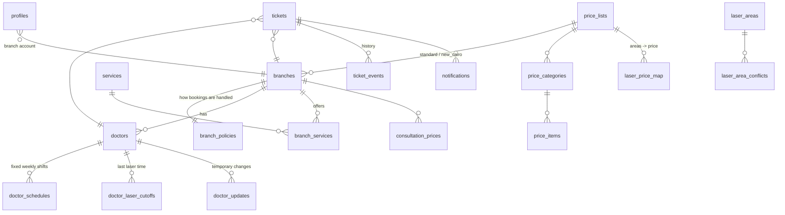

# Phase 1 — Database, Roles, RLS, SLA

Status: ✅ migrations + seed + tests pass on Postgres 16 (local harness).

## 1. The big picture



## 2. Tables in plain words

**Reference data (admin edits, everyone reads)**
| Table | What it holds | Example |
|---|---|---|
| `branches` | name, address, payment, managers, price list | Tanta 1 — Visa / Cash |
| `branch_policies` | how the branch handles bookings | Tanta 1: Saturdays auto-confirm · Tanta 2: same-day always needs the branch · Shebin: no overlap |
| `branch_laser_cutoffs` | branch-wide last laser time | Tanta 2: Mon/Tue/Thu morning shift, no laser after 2 PM |
| `doctors` | one doctor at one branch + her rules | Heba Ghonim: Open, no men, no small-only areas |
| `doctor_schedules` | weekly shifts, several per day allowed | Kholoud, Sat: 10–2 laser, 2–4 other services |
| `doctor_laser_cutoffs` | doctor's last laser time on a day | Mahitab, Sat: 6 PM |
| `services`, `branch_services` | 18 services and which branch offers them | HIFU → Tanta 2 only |
| `laser_areas` | 25 areas (women + men) with minutes | Full Arms 30 min · Bikini Line must not be alone |
| `laser_area_conflicts`, `laser_area_combos` | Half ↔ Full rules, combo durations | Half Arms + Half Leg = −30 min |
| `price_lists`, `price_categories`, `price_items` | full price catalogue (465 items) | New Cairo has its own list |
| `laser_price_map` | which price covers which area(s) | Face + Neck → one bundle price |
| `consultation_prices` | branch price + doctor overrides | Kholoud: derma 350 |
| `kb_articles` | 22 service guides, definitions, call-skills manual | `service:botox`, `manual:scenarios` |

**Written by branches**
| `doctor_updates` | `off` · `stop` · `hours` · `open_slot` (الدور فاضي) · `note` | "Heba off on Tuesday" |

**Workflow**
| `tickets` | the coordination record (not the booking) |
| `ticket_events` | append-only history: created, responded, sla_breached, closed… |
| `notifications` | in-app alerts: new_ticket, ticket_answered, sla_breached |
| `profiles` | role + branch for each login |

## 3. Request, notice, or no ticket? (`resolve_ticket_kind`)

Client decision (2026-10-04, migration 5). First the **effective status** of the
doctor on that date (`effective_booking_status`):
1. Latest branch status override wins: `open_slot` → Confirmed, `force_open` → Open (branch may set these for today/tomorrow only).
2. Else Open doctor on an `auto_confirm_weekdays` day (Tanta 1: Saturday) → Confirmed.
3. Else the doctor's default status.

Then:

| # | Condition | Ticket | Dentolize status |
|---|---|---|---|
| 1 | Branch has `same_day_always_request` and date = today | REQUEST | Open |
| 2 | Effective status = Confirmed | NOTICE | Confirmed |
| 3 | Effective status = Open, date = today or tomorrow | REQUEST (5-min SLA) | Open |
| 4 | Effective status = Open, any later day | **no ticket** (`create_ticket` raises `no_ticket_needed`) | Open |

## 3b. Branch self-service (migration 5)
- `doctor_updates` with `doctor_id = null` = **branch-wide** for a date range: `off` (closed / event), `stop` (fully booked), `note`.
- Branch edits its own doctors' **weekly schedules** (`doctor_schedules`). Doctor rules and prices stay admin-only.
- Every update / schedule change notifies all agents + supervisors (`branch_update`, `schedule_changed`), de-duplicated per 2 minutes.
- `create_ticket` refuses bookings on blocked days: `doctor_unavailable_on_date` / `branch_unavailable_on_date`.

## 4. Ticket lifecycle

```
REQUEST:  pending ──branch_respond──▶ answered ──close_ticket──▶ closed
             │  (5 min) mark_sla_breaches → stays pending, flagged red,
             │                              supervisor notified
             └─ branch_confirm ─────────────────────────────────▶ closed (handled_by_branch)
NOTICE:   pending ──acknowledge_notice──▶ closed
Any open ticket ──cancel_ticket──▶ cancelled
```

## 5. Who can do what (RLS)

| | admin | supervisor | agent | branch |
|---|---|---|---|---|
| Read reference data | ✅ | ✅ | ✅ | ✅ |
| Edit reference data | ✅ | — | — | — |
| Write doctor updates | ✅ | — | — | own branch only |
| See tickets | all | all | all | own branch only |
| Create / close ticket | ✅ | ✅ | ✅ | — |
| Answer / acknowledge | ✅ | — | — | own branch only |
| Cancel ticket | ✅ | ✅ | own tickets | — |
| SLA alerts | — | ✅ | — | — |

Tested in `supabase/tests/10_workflow_and_rls_test.sql`: a branch cannot see or answer another branch's ticket, agents cannot write tickets directly or write updates, a branch cannot write updates for another branch's doctor.

## 6. Deploying to Supabase

1. `supabase init` (keep the existing `supabase/migrations` and `seed.sql`).
2. `supabase link --project-ref <ref>` then `supabase db push`.
3. Load data once: run `supabase/seed.sql` in the SQL editor (or `supabase db reset` locally).
4. Enable **pg_cron** in Dashboard → Database → Extensions if the migration reports it is missing, then re-run the `cron.schedule` line from migration 4.
5. Create the first admin: add a user in Auth, then insert their `profiles` row with role `admin`.

## 7. Open questions (defaults in place, easy to change)

1. ~~Open doctor after tomorrow~~ → decided: no ticket.
2. **Notice acknowledgement**: built as an optional "تم الاطلاع" button, no SLA. Not confirmed yet.
3. **SLA alerts** go to every `supervisor`. Ahmed Taher's account gets that role. Should admins get them too?
4. **Shimaa Hassan's temp note (23/9)** was expired and skipped. The branch can re-add notes as `note` updates.
5. **New Cairo "Lara" Saturday shift** is "other services only" — parsed as `other`. Please verify a few schedules in the admin screen after go-live.
